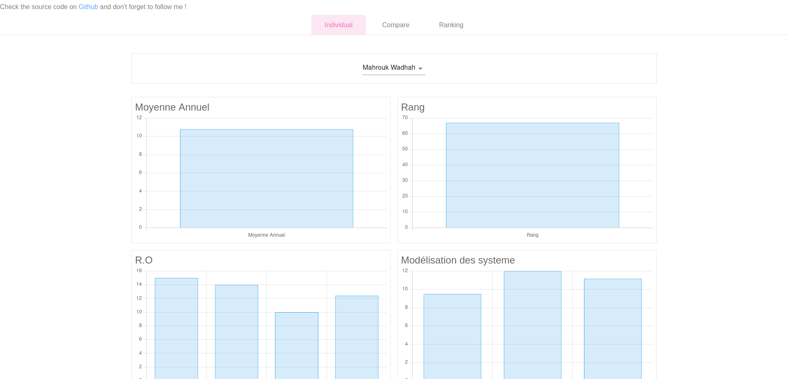

# INSAT-stats

small project making use of university released Excel sheets to better visualize student data.

[Check Me](https://insat-stats.vercel.app/)

## Tech Stack

    - NextJS & [ChartJS](https://github.com/chartjs/Chart.js) for data visualization
    - NextJS Serverless function to transform Excel Sheets into json that can be easily read by Javascript
    - Typescript Generics as the data can have different shapes depending on the concerned class. TYPE CHECKING IS A MUST
